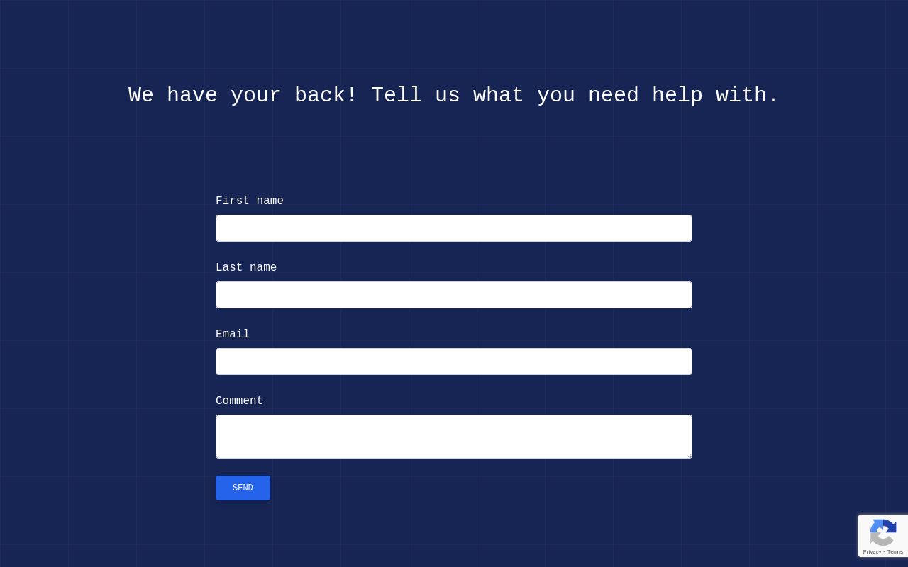

# Hackers Poulette

## Table of contents
- [Introduction](#introduction)
- [Features](#features)
- [Implementation](#implementation)

## Introduction
A contact page that allows users to contact the support team of a fictional company called Hackers Poulette.

The web page was build using: 
- PHP
- Mysql
- HTML
- Tailwind
- JavaScript

## Features
- [X] Form Validation
- [x] Protection against bots, using [google reCaptcha](https://www.google.com/recaptcha/about/)
- [x] Data storage
